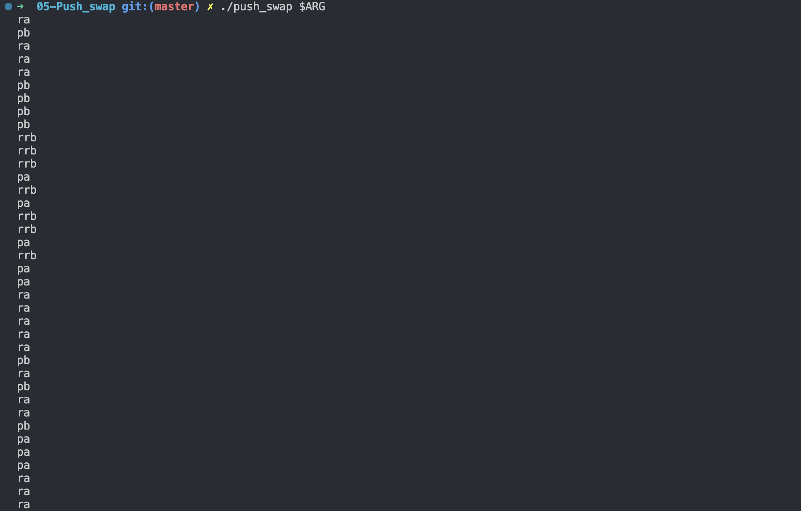

# Push_swap

Push_swap is data sorting algorithm project in which we must sort a list of random numbers with a limited set of instructions in the lowest number of actions.

## Usage

Here are the instructions in order to compile the program

| Command | Usage |
| --- | --- |
| `make` | Compiles program and creates executable ./so_long
| `make clean` | Removes all object files (.o) of project and from libft
| `make fclean` | Removes all objects files (.o), all .a along with executable ./so_long
| `make re` | Removes all objects (.o) files and executable and recompiles them

On MacOS, it is possible to use the ruby number generator and put its content inside a shell variable

```shell
ARG=$(ruby -e "puts (0..99).to_a.shuffle.join(' ')")
```


**Option 1:** Run the program using this shell variable as an argument.

```shell
./push_swap $ARG
```	

**Option 2:** Run the program by putting a list of random numbers inside double quotes.

```shell
./push_swap "48 97 3 70 51 79 44 39 63 49 88 92 53 67 43 11 9 52 29 35"
```

# Project Rules

The project allowed the use of 2 stacks named a and b and a limited set of instructions:

| Instructions           | Explanation     |
| ---------------        | --------------- |
| sa (swap a)            | Swap the first 2 elements at the top of stack a. Do nothing if there is only one or no elements|
| sb (swap b)            | Swap the first 2 elements at the top of stack b. Do nothing if there is only one or no elements|
| ss                     | sa and sb at the same time                                                                     |
| pa (push a)            | Take the first element at the top of b and put it at the top of a. Do nothing if b is empty.   |
| pb (push b)            | Take the first element at the top of a and put it at the top of b. Do nothing if a is empty.   |
| ra (rotate a)          | Shift up all elements of stack a by 1. The first element becomes the last one.                 |
| rb (rotate b)          | Shift up all elements of stack b by 1. The first element becomes the last one.                 |
| rr                     | ra and rb at the same time.																	   |
| rra (reverse rotate a) | Shift down all elements of stack a by 1. The last element becomes the first one.	       |
| rrb (reverse rotate b) | Shift down all elements of stack b by 1. The last element becomes the first one.        |
| rrr                    | rra and rrb at the same time.                                                           |

# Demo 

In order to get a visual representation of all the work done is the data sorting, use the [<u>push_swap visualizer</u>](https://github.com/o-reo/push_swap_visualizer)

# 

# 